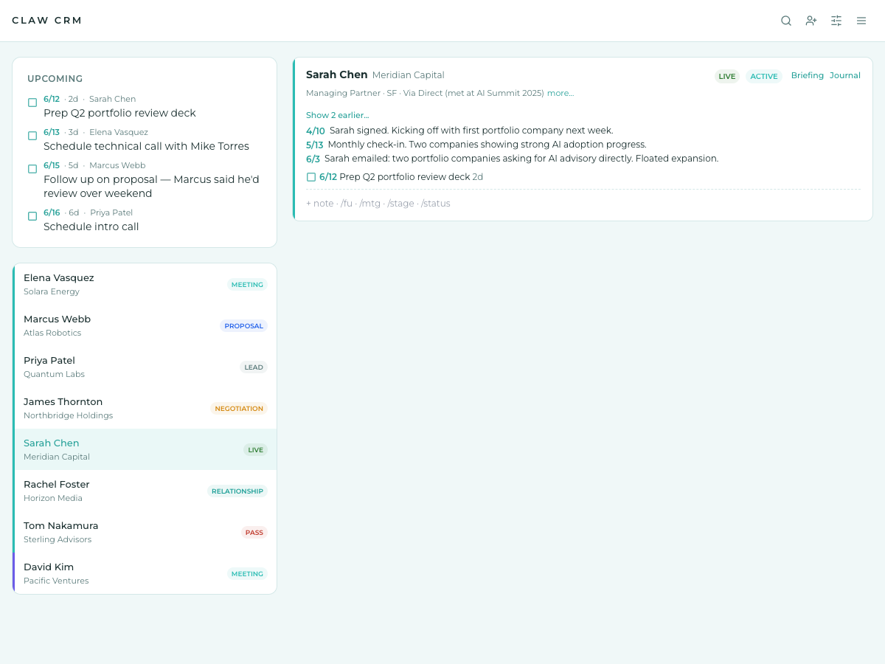
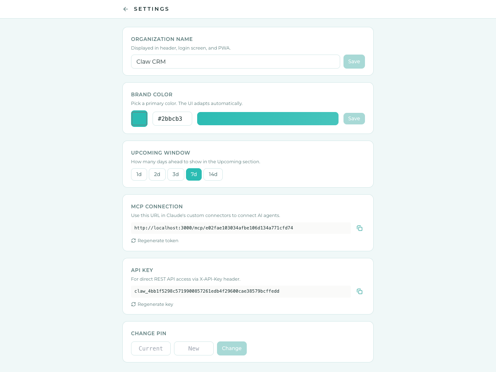
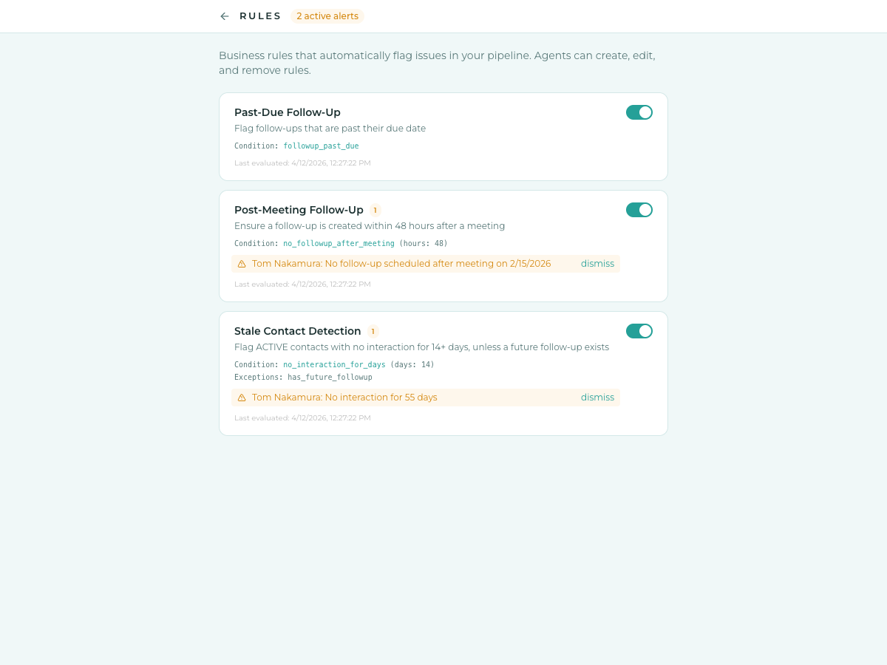

# Claw CRM

**AI-native personal CRM for solo operators.** One scrollable notebook view of your entire pipeline — contacts, interactions, follow-ups, meetings, and rule violations in a single stream. AI agents do the data entry; you make the decisions.

<p align="center">
  <a href="docs/hype.mp4">
    
  </a>
</p>

## Why Claw

Most CRMs are built for sales teams. Claw is built for one person managing 10-50 high-touch relationships — advisors, investors, founders, partners. No dashboards, no charts, no seat licenses. Just a notebook you scroll through every morning.



- **Notebook view** — your entire pipeline in one scrollable feed, sorted by urgency
- **Slash commands** — `/fu 4/15 check on proposal`, `/mtg 4/3 2pm Coffee @ Verve`, `/stage PROPOSAL`
- **AI agents write, you verify** — Claude connects via MCP and manages your CRM through 25+ tools
- **Relationship journal** — a per-contact markdown document that's the durable home for the narrative of the relationship: Key People, Wins / Case Study Material, and dated Entries. Absolute-dates-only validator, full revision history with diff view, verbatim blockquote escape for preserving emails and transcripts.
- **Rules engine** — business logic stored as data, not code. "Flag contacts with no interaction for 14 days." Agents can create, modify, and delete rules.
- **Real-time** — SSE pushes every change to the UI instantly, whether you or an agent made it
- **Privacy-first** — PIN-locked, teal privacy screen on window blur, no pricing or deal terms stored

## Quick Start

```bash
cd app
cp .env.example .env   # set DATABASE_URL and SESSION_SECRET
npm install
npm run db:push        # push schema to Postgres
npm run db:seed        # seed with demo data (PIN: 1234)
npm run dev            # http://localhost:3000
```

## AI Agent Integration



Claw exposes a full [Model Context Protocol](https://modelcontextprotocol.io) (MCP) server so Claude (or any MCP-compatible agent) can manage your CRM autonomously.

### Remote MCP (Claude Web, Desktop, Mobile)

**URL**: `https://your-domain.com/mcp/<TOKEN>`

Set up in Claude: **Settings** > **Custom Connectors** > **Add** > paste the MCP URL > leave OAuth blank > **Add**.

### Local MCP (Claude Desktop, Claude Code)

Uses `mcp-client.ts` which calls the REST API over HTTP:

```json
{
  "mcpServers": {
    "claw-crm": {
      "command": "npx",
      "args": ["tsx", "/path/to/claw-crm/app/server/mcp-client.ts"],
      "env": {
        "CRM_URL": "http://localhost:3000",
        "CRM_API_KEY": "<your-api-key>"
      }
    }
  }
}
```

### Skill (optional but recommended)

`skills/crm/SKILL.md` is a lightweight "when to use the CRM" guide that loads proactively — Claude sees the mental model (data-partition rule, five-layer structure) before any tool call. The detailed writing contract, stage enums, and validation rules stay in `get_crm_guide` and load on-demand.

Install paths:

- **Claude Code**: copy the file into your personal skills directory.
  ```bash
  mkdir -p ~/.claude/skills/crm && cp skills/crm/SKILL.md ~/.claude/skills/crm/
  ```
  Claude Code auto-loads on session start.
- **Claude Desktop / Claude.ai personal**: open a Project → Custom Instructions → paste the SKILL.md body. (Native plugin/skill install for claude.ai consumer isn't available yet; manual paste is the current path.)

The skill assumes the MCP connector has already been registered. If tools are missing it tells Claude to prompt you to add the connector; it doesn't install anything itself.

### Agent prompts

Reference prompts for scheduled agents that operate on your behalf live in [`docs/agent-prompts/`](docs/agent-prompts/). Paste the prompt body into the agent's instructions (e.g. a Claude Cowork or OpenClaw scheduled agent) and point it at the relevant data source plus the CRM MCP connector.

- [**CRM Inbox Agent**](docs/agent-prompts/crm-inbox-agent.md) — daily scan of your inbox (received + sent) to keep the CRM aligned. Logs new interactions, updates stages, completes stale follow-ups, builds briefings when a meeting is imminent, flags anything that needs your decision.

### MCP Tools

| Tool | Description |
|------|-------------|
| `get_crm_guide` | Agent usage guide + live CRM snapshot. Recommended first call. |
| `get_dashboard` | Contacts by stage, overdue tasks, upcoming meetings, violations. |
| `search_contacts` | BM25 full-text search across all contact data (names, notes, tasks, briefings). Ranked, paginated. |
| `get_contact` | Full contact with all related data. |
| `create_contact` | Add a new contact. |
| `update_contact` | Modify contact fields. |
| `delete_contact` | Permanently delete a contact and all related data. |
| `add_interaction` | Log a note, email, meeting, or call. |
| `delete_interaction` | Remove a timeline entry. |
| `create_task` | Create a follow-up task or meeting. |
| `complete_followup` | Mark done + log outcome to timeline. |
| `delete_followup` | Remove a task or meeting. |
| `list_rules` / `create_rule` / `update_rule` / `delete_rule` | Manage business rules. |
| `list_violations` | Active rule violations with contact names. |
| `get_upcoming_meetings` / `cancel_meeting` | Meeting management. |
| `save_briefing` / `get_briefing` | Per-contact prep notes. |
| `read_journal` / `peek_last_journal_entry` | Read the full `relationship_journal` (optional `section` scope) or just the most recent dated Entry + doc hash. |
| `edit_journal` / `append_journal` / `batch_append_journal` | Modify the journal. Absolute-dates-only validator, verbatim blockquote escape, destructive edits gated behind `confirmed_with_user`. `batch_append_journal` writes many dated entries transactionally — the bulk-migration path. |

Tools follow [Anthropic's best practices](https://www.anthropic.com/engineering/writing-tools-for-agents): enum validation, actionable errors, pagination, enriched responses.

## Architecture

```
[Browser UI] <--REST/SSE--> [Express API + Postgres] <--eval--> [Rules Engine]
                                      ^
                                      |
                              [MCP Server (remote)]
                              (primary write path — agents)
```

**Single write path**: all mutations flow through `server/storage.ts` > SSE broadcast > rules evaluation > activity log. Whether a human types a slash command or an agent calls an MCP tool, the same pipeline runs.

## Rules Engine



Rules are business logic stored as data (JSONB), not code. Agents can create and modify them via MCP.

- **Reactive**: evaluated after any write to contacts, interactions, or follow-ups
- **Scheduled**: runs every 15 minutes for time-based conditions
- **Output**: creates/clears violation records, pushed to UI via SSE

| Condition | Description |
|-----------|-------------|
| `no_interaction_for_days` | No interaction for N days |
| `followup_past_due` | Uncompleted follow-up past due date |
| `no_followup_after_meeting` | No follow-up within N hours of a meeting |
| `meeting_within_hours` | Meeting within N hours |
| `status_is` / `stage_is` | Contact has specific status or stage |

Exceptions: `has_future_followup`, `stage_in` (exclude specific stages from rules).

## Data Model

### Pipeline

`LEAD` > `MEETING` > `PROPOSAL` > `NEGOTIATION` > `LIVE` > `PASS`, plus `RELATIONSHIP`

**HOLD** is a status, not a stage. A contact can be stage PROPOSAL + status HOLD.

### Entities

| Entity | Description |
|--------|-------------|
| **Contacts** | People you track. One person per record. |
| **Companies** | Linked to contacts via `companyId`. |
| **Interactions** | Timeline entries — what happened (past tense). |
| **Follow-ups** | Action items with due dates. |
| **Meetings** | Future scheduled events. |
| **Briefings** | Per-contact prep notes (upsert). |
| **Journal** | Per-contact markdown narrative — Key People, Wins / Case Study Material, dated Entries. Full revision history. |
| **Rules** | Business logic — conditions + actions as JSONB. |
| **Violations** | Alerts created by rules, auto-cleared when resolved. |

## Slash Commands

| Command | Example |
|---------|---------|
| `/fu M/D text` | `/fu 4/15 check on proposal` |
| `/mtg M/D time text @ location` | `/mtg 4/3 2pm Coffee @ Verve` |
| `/stage STAGE` | `/stage PROPOSAL` |
| `/status STATUS` | `/status HOLD` |
| plain text + Enter | `Had coffee with Idan` (logs as note) |

## Tech Stack

React, Express, PostgreSQL, Drizzle ORM, Vite, Tailwind CSS, MCP SDK, Playwright E2E, GitHub Actions CI, Railway deploy, PWA (iOS), Pake (Mac desktop).

## License

AGPL-3.0 — see [LICENSE](LICENSE).
