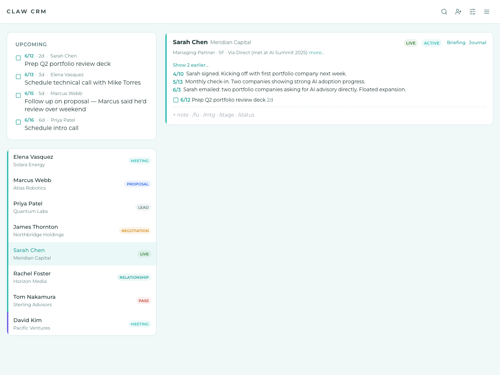
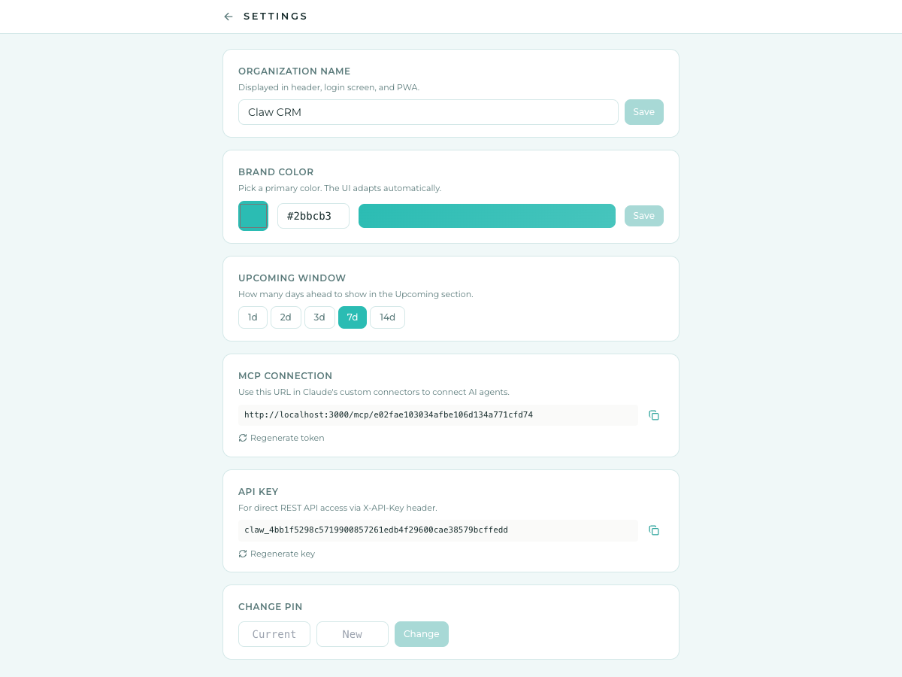
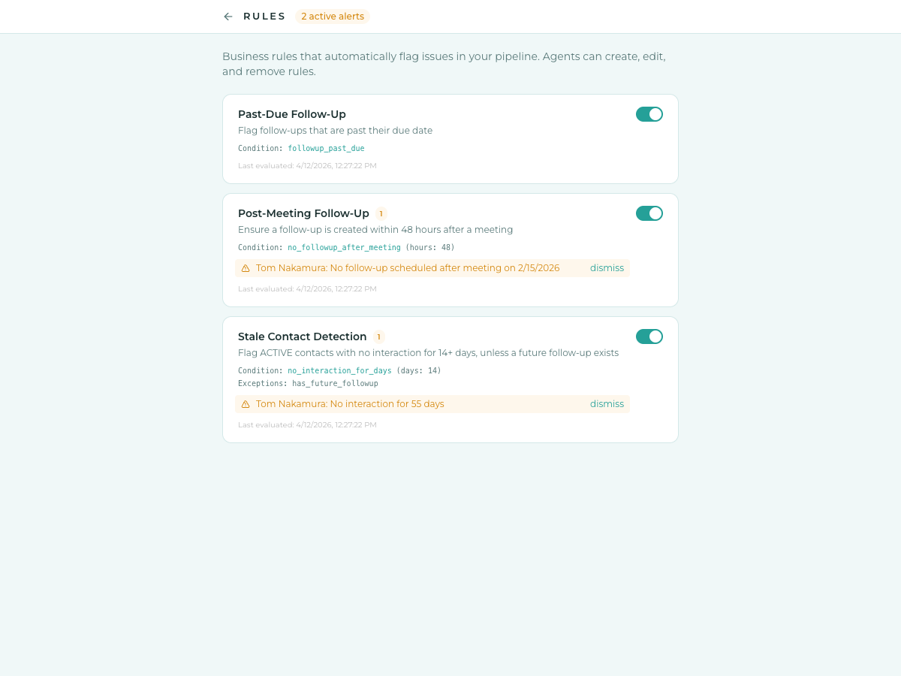

# Claw CRM

**AI-native personal CRM for solo operators.** One scrollable notebook view of your entire pipeline — contacts, interactions, follow-ups, meetings, and rule violations in a single stream. AI agents do the data entry; you make the decisions.

<p align="center">
  <a href="docs/hype.mp4">
    
  </a>
</p>

## Why Claw

Most CRMs are built for sales teams. Claw is built for one person managing 10-50 high-touch relationships — advisors, investors, founders, partners. No dashboards, no charts, no seat licenses. Just a notebook you scroll through every morning.



- **Notebook view** — your entire pipeline in one scrollable feed, sorted by urgency
- **Slash commands** — `/fu 4/15 check on proposal`, `/mtg 4/3 2pm Coffee`, `/stage PROPOSAL`
- **AI agents write, you verify** — Codex, Claude, or another MCP-capable agent manages the CRM through 27+ tools
- **Relationship journal** — a per-contact markdown document that's the durable home for the narrative of the relationship: Key People, Wins / Case Study Material, Engagement History, and dated Entries. Absolute-dates-only validator, full revision history with diff view, verbatim blockquote escape for preserving emails and transcripts.
- **Rules engine** — business logic stored as data, not code. "Flag contacts with no interaction for 14 days." Agents can create, modify, and delete rules.
- **Real-time** — SSE pushes every change to the UI instantly, whether you or an agent made it
- **Privacy-first** — PIN-locked, teal privacy screen on window blur, pricing and deal terms confined to the journal (never in tasks, interactions, briefings, or contact fields), no cross-client references anywhere

## Quick Start

### Docker (recommended — one command, ~2 minutes)

```bash
git clone https://github.com/MagneticStudio/claw-crm.git
cd claw-crm
docker compose up
```

Open [http://localhost:3000](http://localhost:3000) — the first visit walks you through choosing a PIN and hands you your API key + MCP token. No env files, no manual schema push; the schema is applied automatically on first boot. Data persists in a Docker volume across restarts.

Compose publishes port 3000 on the host's `127.0.0.1` by default. Use Docker Engine 28 or newer: older releases have a [known localhost-publication LAN exposure issue](https://docs.docker.com/engine/network/port-publishing/). The app listens on `0.0.0.0` **inside the container** so the host can reach it; this is separate from the host port's exposure.

For remote access, complete PIN setup locally first, set a strong `SESSION_SECRET`, and configure HTTPS and access restrictions through a reverse proxy or firewall. A proxy on the same host can use `127.0.0.1:3000`. If you need a published network port, explicitly set `CLAW_HTTP_BIND` to the intended host IP (or `0.0.0.0` for all IPv4 interfaces) and recreate the app container. Other containers on the same Docker network can still reach the app directly. When using `docker run` instead of Compose, publish with `-p 127.0.0.1:3000:3000` to retain the local-only default.

To connect your AI agent, grab the MCP URL from **Settings**, then follow [AI Agent Integration](#ai-agent-integration) to register the connector and add the shipped skills to the agent's local setup.

### Railway with Codex (recommended hosted path, ~10 minutes)

Use two separate MCP connections:

| Connection | What it lets Codex do |
|---|---|
| **Railway MCP** | Create and operate the Railway project, app service, Postgres service, variables, domain, deploys, and logs. |
| **Claw CRM MCP** | Read and write contacts, interactions, tasks, meetings, rules, journals, and briefings after Claw is deployed. |

1. Fork this repository, clone your fork, and open the folder in Codex.
2. Install and authenticate the [Railway CLI](https://docs.railway.com/cli) with `railway login`.
3. Connect Codex to Railway. On a current Railway CLI:

   ```bash
   railway mcp install --agent codex
   ```

   If your CLI does not yet have the `mcp install` subcommand, use the equivalent local MCP configuration:

   ```bash
   codex mcp add railway -- railway mcp
   ```

4. Start a new Codex task so the Railway tools load, then paste the deployment prompt from [docs/codex-railway-deploy.md](docs/codex-railway-deploy.md). Review the proposed project and service names before approving writes.
5. When Codex reports that `/api/config` returns `200`, open the generated Railway domain. Set a 4-6 digit PIN and copy the MCP URL shown by the setup flow.
6. Connect Codex to the new CRM:

   ```bash
   codex mcp add claw-crm --url "https://your-domain.up.railway.app/mcp/<TOKEN>"
   ```

7. While the cloned repository is still open in Codex, ask it to [install `crm-management`](#skills-install-into-your-agent) into its personal setup on this device.
8. Start another Codex task and ask: `Call get_crm_guide and summarize the live CRM state.` A successful response confirms both connector and skill discovery.

The first startup detects an empty database and applies the base schema once. Established databases skip schema push and use the app's idempotent boot migrations. Do not run `npm run db:seed` on a real instance.

Railway documents both [local and hosted MCP options](https://docs.railway.com/ai/mcp-server). Local MCP is the simplest choice when Codex and the authenticated Railway CLI run on the same machine; the hosted `https://mcp.railway.com` option uses browser OAuth.

### Railway without an agent

1. [Create a new Railway project](https://railway.com/new) → **Deploy from GitHub repo** → choose your fork.
2. Set the app service's **Root Directory** to `app`.
3. Add a **PostgreSQL** service.
4. Set these variables on the app service:
   - `DATABASE_URL` → `${{Postgres.DATABASE_URL}}`
   - `SESSION_SECRET` → a long random value
5. Generate a public domain, wait for the health check to pass, open the domain, and choose your PIN. Pushes to your fork's configured branch will auto-deploy.

Railway's checked-in start command explicitly binds to `0.0.0.0` for proxy and health-check access. A custom start command must preserve `HOST=0.0.0.0`. Hosted deployment intentionally exposes the app: restrict access while completing first-time setup. Before a PIN exists, whoever reaches `/api/setup` first can initialize the instance; network defaults do not add setup authentication.

### Local development

```bash
cd app
cp .env.example .env   # set DATABASE_URL and SESSION_SECRET
npm install
npm run db:push        # push schema to Postgres
npm run db:seed        # seed with demo data (PIN: 1234)
npm run dev            # http://localhost:3000
```

Direct `npm run dev` and `npm start` runs default to `127.0.0.1`. Set `HOST` only when you intentionally need another interface. `HOST` controls the app listener; `CLAW_HTTP_BIND` controls Docker Compose's published host port. To verify both defaults and container ingress, run `npm run test:network` from `app/` with Docker running. It builds a disposable Compose project, uses a random local port, and removes its test containers and database volume afterward.

## AI Agent Integration



Claw exposes a remote [Model Context Protocol](https://modelcontextprotocol.io) server so Codex, Claude, or another Streamable HTTP MCP client can manage the CRM.

The URL has this shape:

```text
https://your-domain.com/mcp/<TOKEN>
```

Treat the complete URL as a password. Do not commit it, place it in a shared prompt, paste it into an issue, or expose it in a screenshot. Regenerating the token in **Settings** immediately invalidates the old URL.

### Codex

```bash
codex mcp add claw-crm --url "https://your-domain.com/mcp/<TOKEN>"
```

Start a new task after adding the connector, then ask Codex to call `get_crm_guide`. To remove or rotate access, regenerate the MCP token in Claw Settings and update the Codex connector.

### Claude Web, Desktop, and Mobile

Set up in Claude: **Settings** > **Custom Connectors** > **Add** > paste the MCP URL > leave OAuth blank > **Add**.

### Local REST bridge (optional)

For a client that cannot use the remote endpoint directly, `mcp-client.ts` exposes a local stdio MCP process backed by Claw's REST API:

```json
{
  "mcpServers": {
    "claw-crm": {
      "command": "npx",
      "args": ["tsx", "/path/to/claw-crm/app/server/mcp-client.ts"],
      "env": {
        "CRM_URL": "http://localhost:3000",
        "CRM_API_KEY": "<your-api-key>"
      }
    }
  }
}
```

### Skills versus agent prompts

They solve different layers of the agent stack:

| Artifact | Purpose | Lifetime | Contains |
|---|---|---|---|
| **Skill** | Teaches the agent how to perform a reusable workflow and when to select it. | Installed once; reused across tasks and schedules. | Trigger conditions, reasoning model, tool procedure, guardrails, validation, and output contract. |
| **Agent prompt** | Assigns one concrete run to an already-capable agent. | One task or recurring schedule. | Invocation, schedule, source scope, time window, and run-specific parameters. |

Rule of thumb: **the skill owns how; the prompt owns when and what to run.** If the same operating instructions appear in both, move them into the skill and leave the prompt as a thin invocation. See the [agent-prompts guide](docs/agent-prompts/README.md) for examples.

### Skills (install into your agent)

Four portable skills ship with the repo, but most operators only need one:

- **Install `skills/crm-management/SKILL.md`** — the primary scheduled sync across received and sent email, calendar, and optional meeting transcripts. It calls `get_crm_guide` directly and does not depend on another skill.
- **Optional: `skills/crm-migrate/SKILL.md`** — a standalone one-time bulk import for existing notes or contact data.
- **Optional: `skills/crm-dreaming/SKILL.md`** — a proposal-first maintenance pass that consolidates journal sprawl, removes duplication, and surfaces stale records without stripping relationship signal.
- **Optional: `skills/crm/SKILL.md`** — proactive intent routing for ad-hoc conversation. It helps the agent recognize “I met someone today” or “follow up Friday” as CRM work without an explicit CRM instruction. The MCP guide already owns the detailed writing contract.

After cloning the repository, open it in Codex or Claude Code and ask:

```text
Install the crm-management directory from this repository's skills folder into your personal skill setup on this device. Copy the complete directory, including references. If it already exists, show me the diff and ask before replacing it. Confirm where you installed it and whether I need to start a new task or session. Briefly explain the optional crm-migrate, crm-dreaming, and crm skills, but do not install them unless I ask.
```

See the [skills installation guide](skills/README.md) for project-local installation, Claude Desktop/Claude.ai, updates, verification, and multi-device use. Register the Claw MCP connector separately; never embed its token in a skill.

### Periodic CRM cleanup

`crm-dreaming` is the maintenance counterpart to the daily sync. It reviews a small batch of contacts for journal sprawl, same-day entry duplication, misplaced information, stale tasks or briefings, and violations of the live CRM contract. It preserves relationship signal, does not ingest inbox or calendar data, and never changes pipeline stages.

Run it weekly, after a high-volume period, or whenever journals have become noisy. Start with a manual pass:

```text
Run CRM dreaming.
```

To focus the pass:

```text
Run CRM dreaming on <contact name or ID>.
```

The agent calls `get_crm_guide`, selects three to five risk-prioritized contacts when none are named, and returns one cleanup proposal per contact. **The proposal phase makes no changes.** Review the previews, then approve only the contacts you want changed:

```text
approve 42
```

The agent rereads the record, applies only the approved proposal, and verifies every write. Unapproved contacts remain unchanged. Scheduled runs are also proposal-only unless the operator returns to approve specific contacts.

Install the complete `skills/crm-dreaming/` directory before using it. For a recurring setup, use the copy-ready [Weekly CRM Dreaming prompt](docs/agent-prompts/weekly-crm-dreaming.md).

### Agent prompts (schedule or paste these)

Reference prompts for scheduled or one-off runs live in [`docs/agent-prompts/`](docs/agent-prompts/). They assume the corresponding skill is installed. Point the agent at the communication connectors plus Claw's MCP connector; keep tokens out of the prompt itself.

- [**Daily CRM Sync**](docs/agent-prompts/daily-crm-sync.md) — a thin scheduler assignment that invokes the canonical `crm-management` skill without restating its operating procedure.
- [**Weekly CRM Dreaming**](docs/agent-prompts/weekly-crm-dreaming.md) — a proposal-only maintenance pass that invokes `crm-dreaming` against a small, risk-prioritized contact batch.

### MCP Tools

| Tool | Description |
|------|-------------|
| `get_crm_guide` | Agent usage guide + live CRM snapshot. Recommended first call. |
| `get_dashboard` | Contacts by stage, overdue tasks, upcoming meetings, violations. |
| `get_contact` | Full contact with all related data. May exceed 150 KB on LIVE clients — for heavy reads use the paginated tools below. |
| `list_interactions` | Paginated interactions for one contact (newest first) with `since` / `until` / `type` filters. |
| `list_followups` | Paginated follow-ups for one contact with `type` / `completed` / `since` / `until` filters. |
| `create_contact` | Add a new contact. |
| `update_contact` | Modify contact fields. |
| `delete_contact` | Permanently delete a contact and all related data. |
| `add_interaction` | Log a note, email, meeting, or call. |
| `delete_interaction` | Remove a timeline entry. |
| `create_task` | Create a follow-up task or meeting. |
| `complete_followup` | Mark done + log outcome to timeline. |
| `delete_followup` | Remove a task or meeting. |
| `list_rules` / `create_rule` / `update_rule` / `delete_rule` | Manage business rules. |
| `list_violations` | Active rule violations with contact names. |
| `get_upcoming_meetings` / `cancel_meeting` | Meeting management. |
| `prepare_briefing` | Gather everything an agent needs before writing a briefing: contact record (with `linkedinUrl`), interactions, followups, journal, any previous briefing (with `ageDays` + `stale` flag), canonical 8-section template, and the research protocol. First call in every briefing workflow. |
| `save_briefing` / `get_briefing` | Upsert / read the briefing. `save_briefing` validates the 8-section structure and rejects missing or out-of-order sections. `get_briefing` returns content + `ageDays` + `stale` (true after 7 days). |
| `list_stale_briefings` / `cleanup_stale_briefings` / `delete_briefing` | Sweep tools for the stale-briefing lifecycle. `list_stale_briefings` returns every stale briefing with `staleReason` (`age` / `meeting_completed` / `wrong_meeting`) so a periodic skill can refresh or delete each. `cleanup_stale_briefings` bulk-deletes the `meeting_completed`-plus-age subset. `delete_briefing` removes a single one. |
| `read_journal` / `peek_last_journal_entry` | Read the full `relationship_journal` (optional `section` scope) or just the most recent dated Entry + doc hash. |
| `edit_journal` / `append_journal` / `batch_append_journal` | Modify the journal. Absolute-dates-only validator, verbatim blockquote escape, destructive edits gated behind `confirmed_with_user`. `batch_append_journal` writes many dated entries transactionally — the bulk-migration path. |

Tools follow [Anthropic's best practices](https://www.anthropic.com/engineering/writing-tools-for-agents): enum validation, actionable errors, pagination, enriched responses.

## Architecture

```
[Browser UI] <--REST/SSE--> [Express API + Postgres] <--eval--> [Rules Engine]
                                      ^
                                      |
                              [MCP Server (remote)]
                              (primary write path — agents)
```

**Single write path**: all mutations flow through `server/storage.ts` > SSE broadcast > rules evaluation > activity log. Whether a human types a slash command or an agent calls an MCP tool, the same pipeline runs.

## Rules Engine



Rules are business logic stored as data (JSONB), not code. Agents can create and modify them via MCP.

- **Reactive**: evaluated after any write to contacts, interactions, or follow-ups
- **Scheduled**: runs every 15 minutes for time-based conditions
- **Output**: creates/clears violation records, pushed to UI via SSE

| Condition | Description |
|-----------|-------------|
| `no_interaction_for_days` | No interaction for N days |
| `followup_past_due` | Uncompleted follow-up past due date |
| `no_followup_after_meeting` | No follow-up within N hours of a meeting |
| `meeting_within_hours` | Meeting within N hours |
| `status_is` / `stage_is` | Contact has specific status or stage |

Exceptions: `has_future_followup`, `stage_in` (exclude specific stages from rules).

## Data Model

### Pipeline

`LEAD` > `MEETING` > `PROPOSAL` > `NEGOTIATION` > `LIVE` > `PASS`, plus `RELATIONSHIP`

**HOLD** is a status, not a stage. A contact can be stage PROPOSAL + status HOLD.

### Entities

| Entity | Description |
|--------|-------------|
| **Contacts** | People you track. One person per record. |
| **Companies** | Linked to contacts via `companyId`. |
| **Interactions** | Timeline entries — what happened (past tense). |
| **Follow-ups** | Action items with due dates. |
| **Meetings** | Future scheduled events. |
| **Briefings** | Per-contact prep for the next specific meeting. Canonical 8-section structure (TL;DR, About them, About the company, Shared ground, Our history, What to discuss, Offers / asks, Watch-outs) enforced by the server. Stale after 7 days — old briefings stop surfacing on contact cards but remain readable on the briefing page. |
| **Journal** | Per-contact markdown narrative — Key People, Wins / Case Study Material, Engagement History, dated Entries. Full revision history. |
| **Rules** | Business logic — conditions + actions as JSONB. |
| **Violations** | Alerts created by rules, auto-cleared when resolved. |

## Slash Commands

| Command | Example |
|---------|---------|
| `/fu M/D text` | `/fu 4/15 check on proposal` |
| `/mtg M/D time text @ location` | `/mtg 4/3 2pm Coffee @ downtown` |
| `/stage STAGE` | `/stage PROPOSAL` |
| `/status STATUS` | `/status HOLD` |
| plain text + Enter | `Had coffee with the new partner` (logs as note) |

## Keyboard Shortcuts

| Shortcut | Action |
|----------|--------|
| `⌘K` / `Ctrl+K` | Open full-text search (MiniSearch / BM25) over contacts, interactions, follow-ups, meetings, briefings. Prefix + fuzzy matching, name and company boosted. `↑`/`↓` move the highlight, `Esc` closes. |

## Tech Stack

React, Express, PostgreSQL, Drizzle ORM, Vite, Tailwind CSS, MCP SDK, Playwright E2E, GitHub Actions CI, Railway deploy, PWA (iOS), Pake (Mac desktop).

## License

AGPL-3.0 — see [LICENSE](LICENSE).
